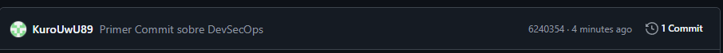
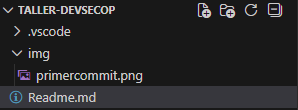

# 🚀 Taller DevSecOps

  

## 📋 Descripción

Este repositorio contiene el material y ejercicios prácticos para el **Taller de DevSecOps**, donde exploramos cómo integrar la seguridad en el ciclo de vida del desarrollo de software.

---

## 🔒 ¿Qué es DevSecOps?

**DevSecOps** es una filosofía de ingeniería de software que integra prácticas de seguridad de manera **automatizada** y **continua** en todo el ciclo de vida del desarrollo de aplicaciones. Es la evolución natural de DevOps, donde la seguridad deja de ser una fase final o un departamento aislado y se convierte en una responsabilidad compartida por todos los equipos.

---
## 📋 Primer Commit

---
## 📋 Punto 3-4

**Eviencia** Vincule mi repositorio creado en github y lo descague local y tambien lo puedo actualizar remoto con estos comandos

git add . //Pasa archivos a carpeta Ensayo
git commit -m "Mensaje de actualizacion" //Traslada archivos al area de repositorio local
git pull origin main //Trae cambios del repo
	Mensaje para autorizar -> :qa enter
git push -u origin main // Carga cambios en repositorio remoto

---

## 🔐 Actividad 3: Investigación e Implementación de Autenticación Segura

## Preguntas Orientadoras (Análisis DevSecOps)

Estas preguntas deben ser respondidas al finalizar el taller para fomentar el pensamiento crítico sobre la seguridad:

1. **Trazabilidad:** ¿Por qué es un riesgo de seguridad dejar la configuración de `user.name` y `user.email` vacía o utilizar datos genéricos en un entorno empresarial?
2. **Cifrado Asimétrico:** En el caso de usar SSH, ¿cuál es la diferencia funcional entre la llave privada y la pública? ¿Qué pasaría si un tercero obtiene acceso a tu llave privada?
3. **Principio de Mínimo Privilegio:** Si decides usar un Token de Acceso Personal (PAT), ¿qué riesgos conlleva asignarle permisos de "Administrador" (Full Control) en lugar de solo permisos de "Lectura/Escritura"?
4. **Higiene del Repositorio:** ¿Para qué sirve el archivo `.gitignore` desde una perspectiva de seguridad? (Menciona al menos dos tipos de archivos que **nunca** deberían subirse al repositorio remoto).
5. **Exposición de Secretos:** Si accidentalmente subes una llave de API o una contraseña al repositorio en GitHub, ¿es suficiente con borrarla y hacer un nuevo *commit*? Justifica tu respuesta.

---

# Respuestas - Análisis DevSecOps

### 1. Trazabilidad
**Respuesta:** Porque si la configuración está vacía o es genérica (ej: "Usuario"), **no se puede saber quién hizo realmente cada cambio**. En una empresa, si hay un error o un ataque, no se puede identificar al responsable, lo que impide investigar y solucionar el problema.

### 2. Cifrado Asimétrico
**Respuesta:**
*   **Diferencia:** La **llave pública** es como un **candado** que puedes compartir con cualquiera para que te envíe mensajes seguros. La **llave privada** es la **única llave** que puede abrir ese candado y debe estar siempre contigo y secreta.
*   **Riesgo:** Si un tercero obtiene tu **llave privada**, puede **hacerse pasar por ti** y acceder a todos los servidores y sistemas donde tengas configurado el acceso con SSH.

### 3. Principio de Mínimo Privilegio
**Respuesta:** Asignar permisos de "Administrador" a un Token es un riesgo muy alto porque si alguien roba ese token (o si se expone), el atacante tiene el **control total** del proyecto o la cuenta. Puede borrar todo, cambiar configuraciones o hasta eliminar el repositorio. Solo debe tener los permisos estrictamente necesarios para su función.

### 4. Higiene del Repositorio (.gitignore)
**Respuesta:** El archivo `.gitignore` sirve para **evitar que archivos sensibles o innecesarios se suban al repositorio** por error.
Dos tipos de archivos que **nunca** deben subirse:
1.  **Archivos de configuración con contraseñas** (ej: `.env`, `config.php` con claves).
2.  **Archivos con llaves privadas** (ej: `id_rsa`, `*.pem`).

### 5. Exposición de Secretos
**Respuesta:** **No, no es suficiente.** Aunque borres el archivo en un nuevo commit, el secreto **sigue estando en el historial del repositorio** (en el commit donde se subió originalmente). Cualquiera con acceso al historial puede encontrarlo. Por eso, además de borrarlo, hay que **rotar (cambiar) la contraseña o clave de inmediato** y considerar purgar el historial.